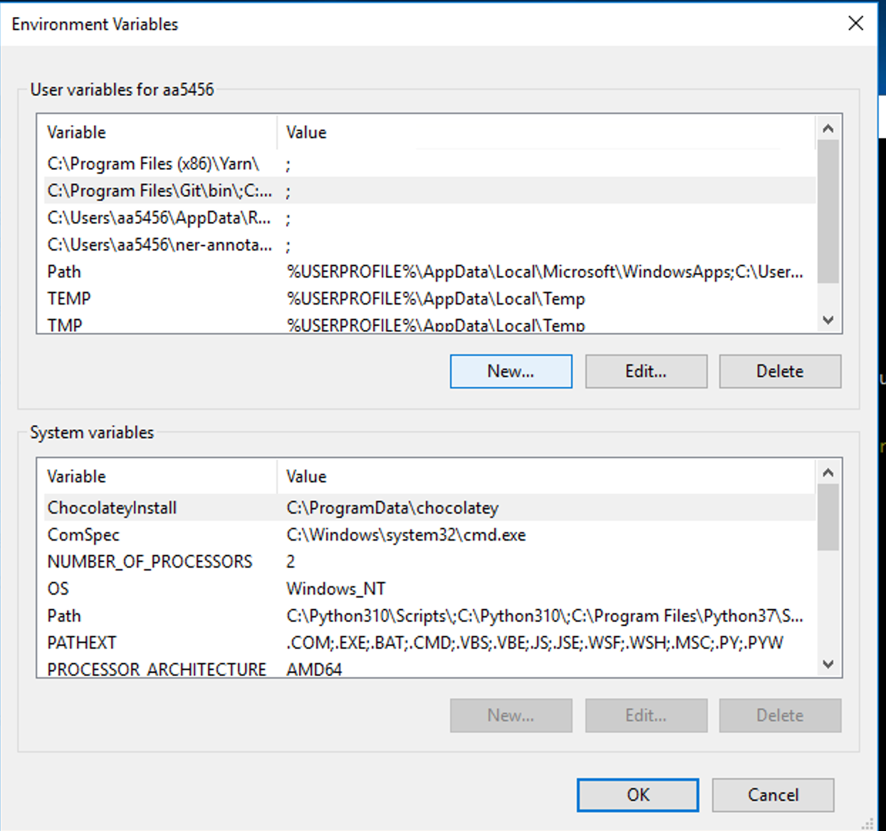

To install the NER-Annotator on Windows Virtual machine, please follow the steps below: 

## I. Install required software

### 1. Setup Git<br>
- Install Git by opening the following link in your browser: https://git-scm.com/download/win <br>
- In the search panel, search for the 'Edit environmental variables on my account' (see image below):<br><br>
 <br><br>

- In the 'Environmental variables' tab, in the 'User variables' section, click on 'New' button (see screenshot below):<br><br>
 <br><br>
- Add the following line in the 'Variable name' entry: C:\Program Files\Git\bin\;C:\Program Files\Git\cmd\ <br>
- Add the following line in the 'Variable value' entry: ; (See the screenshot below):<br><br>
 <br><br>

### 2. Setup NPM:<br>
- In the search panel, search for the 'Edit environmental variables on my account' (see image below):<br>
- In the 'Environmental variables' tab, in the 'User variables' section, click on 'New' button.
- Add the following line in the 'Variable name' entry: C:\Users\netid\AppData\Roaming\npm\ <br>
   Note that you should replace 'netid' with your real nyu netid (e.g. aa5456) <br>
- Add the the following line in the 'Variable value' entry: ; (See the screenshot below):<br><br>
<br><br>

### 3. Setup Yarn<br>
- Install Yarn by opening the following link in your browser: https://classic.yarnpkg.com/lang/en/docs/install/#windows-stable <br>
- In the search panel, search for the 'Edit environmental variables on my account' (see image below):<br>
- In the 'Environmental variables' tab, in the 'User variables' section, click on 'New' button.
- Add the following line in the 'Variable name' entry: C:\Program Files (x86)\Yarn\ <br>
- Add the the following line in the 'Variable value' entry: ; (See the screenshot below):<br><br>
 <br><br>


## II. Run the server
### 1. Clone NER-annotator repository<br>
- Open command prompt and navigate to Desktop by entering this command: <br>
```cd Desktop``` <br>
- Then, enter the following command to clone the repository: <br>
```git clone https://github.com/opengulf/NER-annotator.git``` <br>
- Navigate to the NER-annotator folder that you just cloned: <br>
```cd NER-annotator``` <br>
### 2. Install server requirements<br>
- Create env virtual environment: <br>
```python -m venv env``` <br>
- Activate virtual environment by entering these commands (one after another): <br>
```cd env``` <br>
```.\Scripts\activate``` <br>
- Install requirements:
``` pip install -r requirements.txt ```<br>
- Run the server:
``` python annotator/server.py ```<br>
- View the gif below and follow the instructions: <br><br>
 <br><br>
- Upon successful completion, you should see the following terminal output:<br><br>
 <br><br>

## III. Run the client
- Open a new command prompt (note: don't close your open command prompt where the server is running). <br>
- Navigate to the ui folder: <br>
```cd Desktop/NER-annotator/ui``` <br>
- Install yarn reqs:
``` yarn install ```<br>
- Run yarn server:
``` yarn serve ```<br>
- View the gif below and follow the instructions: <br><br>
 <br><br>


### IV. Test the NER-annotator<br>
- Navigate to the following link in your browser: http://localhost:8080/ (should be the same link that appears as an output of the 'yarn serve' commmand<br>
  You should see the following page: <br><br>
   <br><br>
- Click on the 'Select file to start annotating' and select a file named 'tester' in the 'NER-annotator' file as a file to be annotated (see screenshot below):<br><br>
 <br><br>
- You should see the following page:<br><br>
 <br><br>
- To annotate the text, add a new tag and try annotating the first line. Visit the Notion page to view further annotation instructions.


